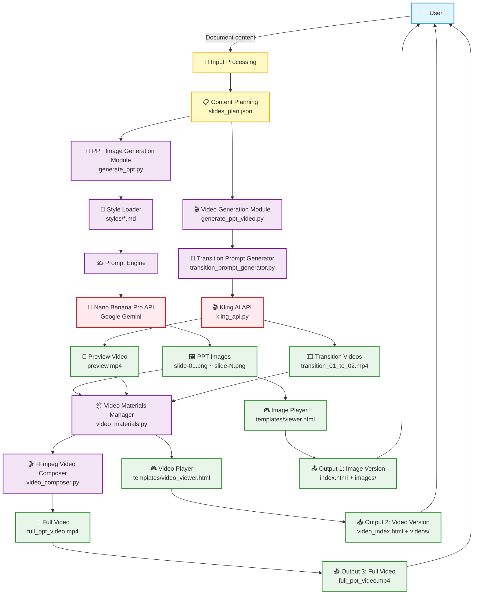

# PPT Generator Pro Architecture Documentation

## 📐 System Architecture Diagram



## 🏗️ Module Architecture

### 1️⃣ Core Generation Modules

```
┌─────────────────────────────────────────────────────────────┐
│                    PPT Generator Pro                         │
├─────────────────────────────────────────────────────────────┤
│                                                              │
│  ┌────────────────────┐        ┌──────────────────────┐    │
│  │  Image Generation  │        │   Video Generation   │    │
│  │  generate_ppt.py   │        │ generate_ppt_video.py│    │
│  └────────────────────┘        └──────────────────────┘    │
│           │                              │                  │
│           ▼                              ▼                  │
│  ┌────────────────────┐        ┌──────────────────────┐    │
│  │   Style System     │        │  Transition Prompt   │    │
│  │   styles/*.md      │        │     Generation       │    │
│  │                    │        │ transition_prompt_   │    │
│  │                    │        │   generator.py       │    │
│  └────────────────────┘        └──────────────────────┘    │
│           │                              │                  │
│           ▼                              ▼                  │
│  ┌────────────────────┐        ┌──────────────────────┐    │
│  │ Nano Banana Pro    │        │   Kling AI API       │    │
│  │ (Gemini 3 Pro)     │        │   kling_api.py       │    │
│  └────────────────────┘        └──────────────────────┘    │
│           │                              │                  │
│           ▼                              ▼                  │
│    🖼️ PPT Images                  🎬 Transition Videos      │
│                                                              │
└─────────────────────────────────────────────────────────────┘
```

### 2️⃣ Video Composition Module

```
┌─────────────────────────────────────────────────────────────┐
│               FFmpeg Video Composition Pipeline              │
├─────────────────────────────────────────────────────────────┤
│                                                              │
│  Input Materials:                                            │
│  ├── 📷 PPT Images (slide-01.png ~ slide-N.png)             │
│  ├── 🔄 Preview Video (preview.mp4)                         │
│  └── 🎞️ Transition Videos (transition_XX_to_YY.mp4)        │
│                                                              │
│  ┌────────────────────────────────────────────────┐         │
│  │     video_materials.py - Materials Manager    │         │
│  │  • Collect all materials                       │         │
│  │  • Verify file integrity                       │         │
│  │  • Organize material sequence                  │         │
│  └────────────────────────────────────────────────┘         │
│                       │                                      │
│                       ▼                                      │
│  ┌────────────────────────────────────────────────┐         │
│  │     video_composer.py - FFmpeg Composer       │         │
│  │                                                │         │
│  │  Step 1: Convert images to static video        │         │
│  │    • Convert to 2-second static clips          │         │
│  │    • Normalize to 1920x1080                    │         │
│  │    • Normalize to 24fps                        │         │
│  │                                                │         │
│  │  Step 2: Normalize all videos                  │         │
│  │    • Scale to unified resolution               │         │
│  │    • Add letterboxing to preserve aspect ratio │         │
│  │    • Unify frame rate                          │         │
│  │                                                │         │
│  │  Step 3: Concatenate video sequence            │         │
│  │    Preview → Trans01-02 → Static02 → Trans02-03│         │
│  │                                                │         │
│  │  Step 4: H.264 encode and output               │         │
│  └────────────────────────────────────────────────┘         │
│                       │                                      │
│                       ▼                                      │
│              🎥 full_ppt_video.mp4                          │
│                                                              │
└─────────────────────────────────────────────────────────────┘
```

### 3️⃣ Player System

```
┌─────────────────────────────────────────────────────────────┐
│                     Player Architecture                      │
├─────────────────────────────────────────────────────────────┤
│                                                              │
│  ┌───────────────────────┐    ┌────────────────────────┐   │
│  │     Image Player      │    │     Video Player       │   │
│  │     viewer.html       │    │  video_viewer.html     │   │
│  ├───────────────────────┤    ├────────────────────────┤   │
│  │                       │    │                        │   │
│  │  • Image slideshow    │    │  • Video + image mix   │   │
│  │  • Keyboard nav       │    │  • Smart transitions   │   │
│  │  • Fullscreen         │    │  • Preview mode        │   │
│  │  • Touch/swipe        │    │  • State management    │   │
│  │  • Auto-play          │    │  • Keyboard controls   │   │
│  │                       │    │                        │   │
│  └───────────────────────┘    └────────────────────────┘   │
│           │                              │                  │
│           ▼                              ▼                  │
│   📁 outputs/TIMESTAMP/        📁 outputs/TIMESTAMP_video/  │
│                                                              │
└─────────────────────────────────────────────────────────────┘
```

## 🔄 Data Flow Diagram

```
┌──────────────────────────────────────────────────────────────────┐
│                         Full Workflow                             │
└──────────────────────────────────────────────────────────────────┘

1️⃣ Content Input Phase
   User document → Claude analysis → slides_plan.json

2️⃣ Image Generation Phase
   slides_plan.json → Style prompts → Nano Banana Pro → PPT images

3️⃣ Video Generation Phase (optional)
   PPT images → Transition prompts → Kling AI → Transition videos

4️⃣ Player Generation Phase
   Material set → HTML templates → Interactive player

5️⃣ Full Video Composition Phase (optional)
   All materials → FFmpeg → Full video file
```

## 📦 File Organization

```
ppt-generator-pro/
│
├── 🎯 Core Scripts
│   ├── generate_ppt.py              # PPT image generation main script
│   ├── generate_ppt_video.py        # Video generation main script
│   ├── kling_api.py                 # Kling AI API wrapper
│   ├── video_composer.py            # FFmpeg video composition
│   ├── video_materials.py           # Materials management
│   └── transition_prompt_generator.py # Transition prompt generator
│
├── 🎨 Style System
│   └── styles/
│       ├── gradient-glass.md        # Gradient glassmorphism style
│       └── vector-illustration.md   # Vector illustration style
│
├── 🎮 Player Templates
│   └── templates/
│       ├── viewer.html              # Image player
│       └── video_viewer.html        # Video player
│
├── 📝 Prompt Templates
│   └── prompts/
│       └── transition_base.md       # Base transition prompt
│
├── ⚙️ Configuration Files
│   ├── .env                         # API key configuration
│   └── .env.example                 # Configuration template
│
└── 📤 Output Directory
    └── outputs/
        ├── TIMESTAMP/               # Image version
        │   ├── images/             # PPT images
        │   ├── index.html          # Image player
        │   └── prompts.json        # Prompt log
        └── TIMESTAMP_video/         # Video version
            ├── videos/             # Transition videos
            ├── video_index.html    # Video player
            └── full_ppt_video.mp4  # Full video
```

## 🔌 API Integration Architecture

```
┌─────────────────────────────────────────────────────────────┐
│                      API Integration Layer                   │
├─────────────────────────────────────────────────────────────┤
│                                                              │
│  ┌──────────────────────┐      ┌───────────────────────┐   │
│  │  Google Gemini API   │      │    Kling AI API       │   │
│  ├──────────────────────┤      ├───────────────────────┤   │
│  │                      │      │                       │   │
│  │  • Nano Banana Pro   │      │  • Image-to-video     │   │
│  │  • Image generation  │      │  • Video generation   │   │
│  │  • Prompt engineering│      │  • Digital human      │   │
│  │  • Style control     │      │  • Subject library    │   │
│  │  • Resolution control│      │  • Pro/creative mode  │   │
│  │                      │      │                       │   │
│  └──────────────────────┘      └───────────────────────┘   │
│           ▲                              ▲                  │
│           │                              │                  │
│  ┌────────┴───────────┐      ┌──────────┴────────────┐    │
│  │  GEMINI_API_KEY    │      │  KLING_ACCESS_KEY     │    │
│  │  (required)        │      │  KLING_SECRET_KEY     │    │
│  │                    │      │  (optional)           │    │
│  └────────────────────┘      └───────────────────────┘    │
│           ▲                              ▲                  │
│           └──────────────┬───────────────┘                 │
│                          │                                  │
│                    ┌─────┴──────┐                          │
│                    │  .env file  │                          │
│                    └────────────┘                          │
│                                                              │
└─────────────────────────────────────────────────────────────┘
```

## 🎬 Video Player State Machine

```
┌─────────────────────────────────────────────────────────────┐
│        Video Player (VideoPPTPlayer) State Machine           │
├─────────────────────────────────────────────────────────────┤
│                                                              │
│      ┌──────────────────────────────────┐                  │
│      │    Initial State: Preview Mode   │                  │
│      │   🔄 Playing preview.mp4 (loop) │                  │
│      └──────────────────────────────────┘                  │
│                     │                                        │
│                     │ User presses → key                    │
│                     ▼                                        │
│      ┌──────────────────────────────────┐                  │
│      │   Transition State (01→02)       │                  │
│      │   🎞️ Playing transition_01_to_02 │                  │
│      │      isTransitioning = true      │                  │
│      └──────────────────────────────────┘                  │
│                     │                                        │
│                     │ Video ends                            │
│                     ▼                                        │
│      ┌──────────────────────────────────┐                  │
│      │   Static Slide State (Slide 2)   │                  │
│      │   🖼️ Showing slide-02.png        │                  │
│      │      currentSlide = 1            │                  │
│      │      isPreviewMode = false       │                  │
│      └──────────────────────────────────┘                  │
│                     │                                        │
│                     │ User presses → key                    │
│                     ▼                                        │
│      ┌──────────────────────────────────┐                  │
│      │   Transition State (02→03)       │                  │
│      │   🎞️ Playing transition_02_to_03 │                  │
│      └──────────────────────────────────┘                  │
│                     │                                        │
│                     │ Video ends                            │
│                     ▼                                        │
│      ┌──────────────────────────────────┐                  │
│      │   Static Slide State (Slide 3)   │                  │
│      │   🖼️ Showing slide-03.png        │                  │
│      └──────────────────────────────────┘                  │
│                     │                                        │
│                     │ Cycle continues...                    │
│                     ▼                                        │
│                                                              │
└─────────────────────────────────────────────────────────────┘

Key State Variables:
• isPreviewMode: whether currently in preview mode
• isTransitioning: whether a transition video is playing
• currentSlide: current slide index
```

## 🛠️ Tech Stack

```
┌─────────────────────────────────────────────────────────────┐
│                          Tech Stack                          │
├─────────────────────────────────────────────────────────────┤
│                                                              │
│  Backend (Python 3.8+)                                      │
│  ├── google-genai       # Google Gemini API client          │
│  ├── pillow            # Image processing                    │
│  └── requests          # HTTP requests                       │
│                                                              │
│  Video Processing                                            │
│  └── FFmpeg            # Video encoding, conversion, and    │
│                          composition                         │
│                                                              │
│  Frontend (HTML5 + JavaScript)                              │
│  ├── Vanilla JavaScript # Player logic                       │
│  ├── HTML5 Video       # Video playback                      │
│  └── CSS3              # Styles and animations               │
│                                                              │
│  AI Services                                                 │
│  ├── Google Nano Banana Pro (Gemini 3 Pro Image Preview)    │
│  └── Kling AI                                               │
│                                                              │
└─────────────────────────────────────────────────────────────┘
```

## 📊 Performance Metrics

```
Generation Speed:
├── PPT images: ~30s/slide (2K) | ~60s/slide (4K)
├── Transition videos: ~30–60s/segment (Kling AI)
└── Video composition: ~5–10s (FFmpeg, depends on slide count)

File Size:
├── PPT images: ~2.5MB/slide (2K) | ~8MB/slide (4K)
├── Transition videos: ~3–5MB/segment (1080p, 5 seconds)
└── Full video: ~12–20MB (5-slide PPT + transitions)

Quality Parameters:
├── Images: 2752x1536 (2K) | 5504x3072 (4K)
├── Video: 1920x1080, 24fps, H.264
└── Encoding: CRF 23 (high quality)
```

---

## 🎯 Usage Flow Summary

### Basic Flow (images only)
```
User document → Content planning → Generate images → Image player → ✅
```

### Full Flow (images + video)
```
User document → Content planning → Generate images → Generate transitions
             → Video player + Full video → ✅
```

### Quick Flow (full video only)
```
User document → Content planning → Generate images → Generate video
             → Export MP4 → Share directly → ✅
```

---

<div align="center">

**🏗️ Architecture Design Principles**

Modular • Extensible • High Cohesion, Low Coupling • API-Driven

Made with ❤️ by 歸藏

</div>
